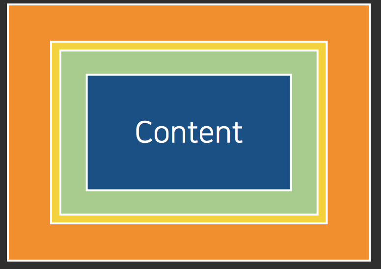
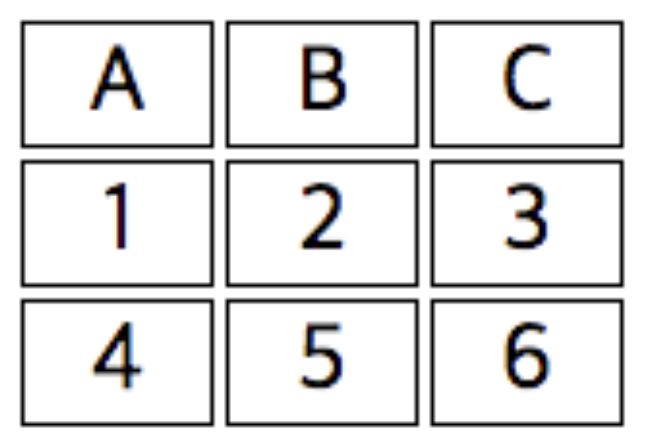
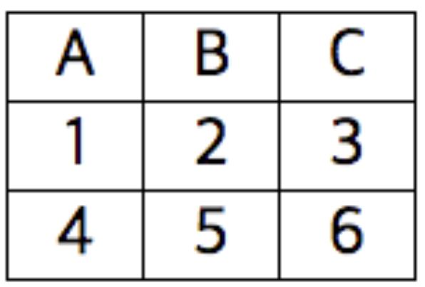
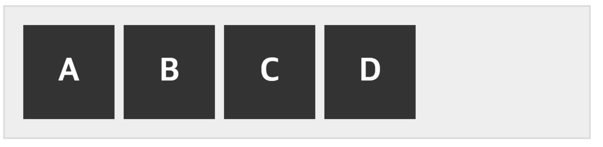

#17.05.10 수

##HTML & CSS

- CSS 요소 (element)
- CSS Box model
- CSS list style
- CSS table style

--


###CSS요소(element)

>선굵기의 지정

>```css
div {  
	border-width: 3px; 전체
	border-top-width: 4px;   위에 선만
	border-width: 3px 4px 5px 6px;  위에서부터 시계방향으로 
	border-width: 5px 10px;  상하 좌우
	}
```
--

> 선형태 지정

>```css
>div {
>	border-style: solid;
>	border-top-style: double;
>	border-style: solid double dashed dotted;
>}
>```
	
>> solid 실선.  
> dotted 점선.  
> dashed 바느질선 형태의 점선.  
> double 이중선.   
> inset 요소 전체가 안으로 들어가 보임.   
> groove 입체적으로 보여줌.   
> outset 요소 전체가 바깥으로 나와 보임.        
> ridge groove와 반대방향으로 선이 돌출. 
>   
--

> 선 색상
> 
> ```css
> div {
> 	border-color: black;
> 	border-color: red blue yellow green;
> }
> ```
> 각각의 색상을 지정할 수 있다.


### CSS Box Model
> #### **inlne 요소와 box 요소의 차이**
>  **inline 요소**
> > - 인라인 요소의 가로와 세로의 길이는 조절이 불가능 하다.(내용에 자동으로 맞춰진다.)  
> > - 인라인 요소는 가로 마진만 갖는다.
> > 
> 
> 
>  **box 요소**
> >   
> > 박스요소는 바깥에서부터 **마진(orange)>보더(yellow)>패딩(green)>콘텐츠(blue)** 형태를 이루고 있다.
> 
> margin(바깥 여백)
> 
> ```css
> div{
> 	margin: 4px; 전체 바깥 여백 설정
> 	margin: 3px 4px; 상하 좌우 바깥 여백 설정
>	margin: 1px 2px 3px 4px: 각각의 바깥 여백 설정
> 	margin-top: 2px; 위의 바깥 여백만 설정
> }
> ```
> 
> margin이 서로 겹칠 때
> 
> > 두블록요소의마진이서로겹칠경우,해당하는마진값이더해지는것이아니라둘중큰값만이적용됩니다.
(세로가 아닌 가로에서는 해당 현상이 없습니다. 가로에서는 다음 행으로 밀림.)  
 따라서, 서로 위/아래로 겹치는 마진값을 준 경우, 한 쪽에만 값을 몰아주거나, padding을 활용하는 방식으로 해결해야 합니다.
> >
> 
> padding
> 
> ```css
> div{
> 	padding-top: 2px; 위쪽 내부 여백 지정
> 	padding-bottom: 3px; 아랫쪽 내부 여백 지정
>	padding: 4px: 전체 내부 여백 지정
>}
>```
> 
> --
> 
> box-sizing
> 
> ```
> div{
> 	width: 100px; 가로
> 	height: 200px; 세로
> 	box-sizing: border-box;
> }
> ```
> **box-sizing: border-box;** 는 padding margin 제외한 새로운 contents를 지정하여 width 지정값에 맞춤(width가 전체 크기가 됨)
> 


### CSS List Style
> list style의  Bullet을 없애거나 다른 것으로 바꾸거나 할 수 있다.
>
>```css
>ul {
>	list-style-type: none; 리스트 불릿을 보이지 않음.
>	list-style-type: squre; 네모
>}
>```
>
>list style에 점같은 거 대신 이미지를 넣을 수 있다.
>
>```css
>ul {  
>	list-style-image: url('images/mic.png');  
>}
>```
>[참고] ul, ol요소의 패딩값을 따로 조정하여 들여쓰기 여백을 조정할 수 있다.
>

### CSS Table
> 테두리를 보이게
> 
> ```css
> .html
> emmet형식] table>(tr>td*3)*3 [tab]
> ---------------------------------
> .css
> tr, td {  
> 	border: 1px solid black;
> 	width: 30px;
> 	text-align: center;
> }
> ```
> 
> 
> 위의 상태에서 테이블 테투리 합치기
> 
> ```css
> table {
> 	border-collapse: collapse;
> }
> ``` 
>
>
>
>테이블 셀 간격 지정
>
>```css
>table {
>	border-spacing: 10px;  
>} 
>```
> : 각 셀간 간격을 지정하여 떨어뜨릴 수 있다.
>
>--
>
>테이블의 레이아웃
>> 테이블의 기본 설정은 내용이 긴 쪽이 더 늘어난다.
>
>테이블 레이아웃을 fixed로 설정하면, 셀 길이가 일정하게 유지된다.(반드시 table의 width가 설정되어야 함)

---


#17.05.11 목

##HTML & CSS
- CSS display
- CSS float
- CSS float layout
- CSS position
- Sass - CSS 전처리기

--

### CSS display
> 원래 Inline 속성인 요소들
> 
> ```
> <span>
> <a>
> 
> <br>
> <button>
> <i>
> <input>
> <label>
> 
> abbr
> acronym
> b
> bdo
> big
cite
code
dfn
em
kbd
map
object
q
samp
small
script
select
strong
sub
sup
textarea
tt
var
> ```
> 
> --
> 
> 원래 Block 속성인 요소들
>
>```
><div>
><p>
><pre>
><table>
><ol>
><ul>
>
>address
article
aside
audio
blockquote
canvas
dd
dl
fieldset
figcaption
figure
footer
form
h1
h2
h3
h4
h5
h6
header
hgroup
hr
noscript
output
section
tfoot
video
>```
>
>####**속성의 할당**
>인라인 요소를 블럭 요소로 할당
>
>```css
>span {
>	display: block;
>}
>```
>
>--
>
>블럭 요소를 인라인 요소로 할당
>
>```css
>span {
>	display: inline;
>}
>```
>
>--
>
>inline-block 요소
>
>```css
>span {
>	display: inline-block;
>}
>```
>
>기본적으로는 인라인 요소이나 블럭처럼 높이 및 상하값을 가질 수 있다.
>
>--
>

###CSS float
부모 element의 공간에 띄어(float)주는 기술

float 요소와 겹치는 경우 해제하기

```
p{
	clear: both;
	clear: left;
	clear: right;
}
```

> float layout
> 
> > html 예제
> >
> >```
> > <div class="float-rame">
    <div class="float-unit">A</div>
    <div class="float-unit">B</div>
    <div class="float-unit">C</div>
    <div class="float-unit">D</div>
> >```
> 
> css 설정
> 
> ```
>   .float-rame {
    width: 300px;
    background-color: #eee;
    border: 1px solid #ddd;
    padding: 10px;
  }
  .float-unit {
    width: 50px;
    background-color: #333;
    color: #fff;
    font-size: 18px;
    font-weight: bold;
    text-align: center;
    padding: 15px 0;
    margin-right: 5px;
    float: left;
  }
>```
> 위와 같이 float: left; 를 넣으면 해당 클래스 속성의 블록들은 모두 부모 element의 영역으로 왼쪽 정렬 한다.
>
>여기에 after 가상 선택자를 사용
>
>```
>  .float-rame::after{
    content: '';
    display: block;
    height: 0;
    clear: both;
  }
>```
>를 넣어주면 모든 요소가 floating이 되어도 부모요소에 안정적으로 종속된다.
>(부모 요소의 content가 비었다면(모두 float 되었다면)) 해당 after의 지정된 테그들이 마지막에 추가된다.
>
>
>완성된 모습.  
>
>
>--
>

### CSS Position
요소의 위치를 지정

- static : 기본값
- relative : static과 같지만 left right top bottom 을 지정할 수 있음
- fixed : 브라우저의 창을 기준으로(보여지는 공간을 기준으로 위치 부여)
- absolute : 부모 element를 기준으로 위치 부여(부모 element가 없는 경우는 body를 기준으로 함)

>html 문서상
>
>```html
><div class="relative1">
>	relative1
>	<div class="relative2">relative2</div>
></div>
>```
>  
>css 문서상
>
>```css
>.relative1 {
  width: 200px;
  height: 200px;
  position: relative;
}
.relative2 {
  width: 50px;
  height: 50px;
  position: relative;
  top: 30px;
  left: 100px;
}
>```
>  
>가운데 정렬
>> 가로 가운데 정렬.  
>>```margin: 0 auto;```
>>    
>> 세로 가운데 정렬.  
>> ```line-height를 부모요소의 height의 값과 똑같이 하면 세로로 가운데 정렬됨.```
><br>
>
>가로 세로 동시 가운데 정렬
>
>```css
> position: absolute;   
> top: 50%;   
> left: 50%;   
> transform: translate(-50%, -50%);   
>```
>
---

<br>

###Sass - CSS 전처리기
--
####환경설정 - Mac OS

<a href="https://github.com/Fastcampus-WPS-5th/Utils/blob/master/atom.md">Sass 환경설정 참조 링크(git hub)</a>

> 1. homebrew가 설처된 상태에서
> 2. ```brew install node```
> 3. 설치 후 확인하기 ```node -v``` 입력 후 v7.?.? 또는 v4.?.? 나오면 성공!
> 4. npm패키지 설치 ```sudo npm install node-sass -g```
> 5. 설치 완료

이후 Atom에서 환경설정

> 1. settings > 'sass auto' 검색
> 2. 'sass autocomplie' 패키지 설치
> 3. 패키지 설정에서 컴파일된 파일들의 저장위치 지정하기 ex) ../css/$1.min.css

Sass 사용하기

> 1. Sass, css, html 파일이 들어갈 폴더를 각각 만든다.
> 2. sass파일의 확장자명은 .scss이고 저장할때마다 지정된 경로로 compile	이 자동으로 되어 .css 파일을 만들어 준다.

 
출력스타일

- Compile on Save  - 저장시 자동 컴파일
- Compile with ‘compressed’  - Compressed 방식 파일 생성
- Compile with ‘compact’  - compact 방식으로 파일 생성
- Compile with ‘nested’  - Nested 방식 파일 생성
- Compile with ‘expanded’ - Expanded 방식 파일 생성
        
Sass문법
> - 주석  
>  - // : 내부 주석(컴파일 안됨)  
>  - /* ~~ */ : css주석 (컴파일시 반영)
> - 중첩  
>  - .container > #someid : 자식 연산자를 만들어냄.
>  - 다른 요소의 괄호 안에 작성 : 하위 연산자를 만들어냄.
> - 부모참조 연산자 & : 자신의 부모를 그대로 그 위체에 복사해 와서 css element를 쉽게 지정
> - 중첩 속성
> - 선택자 상속
> 	- @extend 부모의 기본적 속성을 그대로 상속하고 다른 부분만 따로 만듬.
> - 대체 선택자 % : CSS구문으로 해석되지 않고 완전 무시됨.
> 

Sass 변수 설정하여 사용하기
> 
> 1. 변수 파일 만들기 : 파일 명 앞에 _자를 붙인후 확장자를 .scss로 하면 컴파일 되지 않고 import전용으로 쓸 수 있는 변수 파일을 만들 수 있다.
> 2. scss파일에서 import 할 때
> 
>    ```
> 	_variable.scss 파일을 import
> 		@import "variable";
> ```
> 
---


